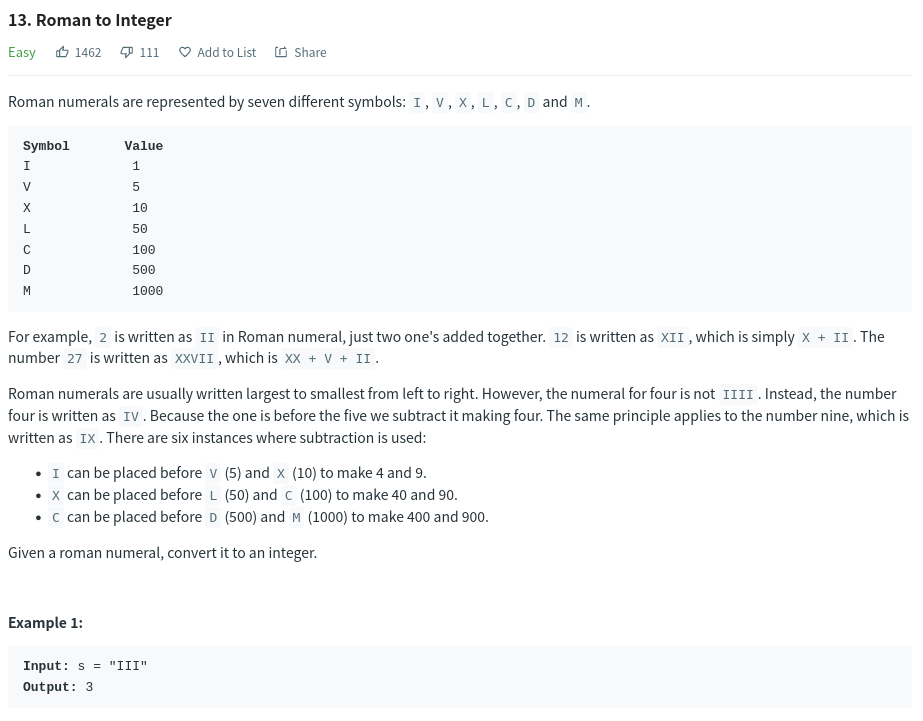
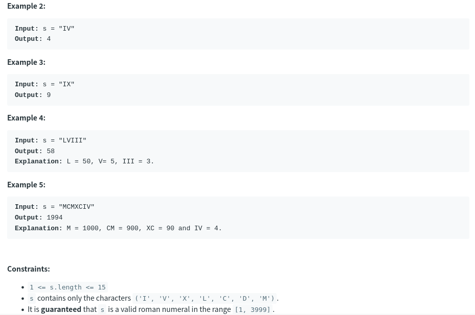

# ROMAN-TO-INTEGER




# **Right-Left-Pass**

- loop through the symbols in s
- if current < next : subtract current from total : add current in total
- return total

```js
/**
 * romantoint.js
 * @param {string} s
 * @return {number}
 */
 var romanToInt = function (s) {
    const romanNumerals = {
        I: 1,
        V: 5,
        X: 10,
        L: 50,
        C: 100,
        D: 500,
        M: 1000
    }

    let value = 0;

    for (let i = 0; i < s.length; i++) {
        const current = romanNumerals[s[i]];
        const next = romanNumerals[s[i+1]];
        (current < next) && (next!==undefined) ? value -= current : value += current;
    }
    return value;
}
```

# **Look Up Table**
- Store the Symbol Values in lookup table
- loop pointer s untill reached `'\0'` apply above algorithm
```C
/*
* romanint.c
*/

unsigned int table[90] = {
    ['I'] = 1,
    ['V'] = 5,
    ['X'] = 10,
    ['L'] = 50,
    ['C'] = 100,
    ['D'] = 500,
    ['M'] = 1000
};

int romanToInt(char *s){
    int res = 0;
    char next;
    while (*s != '\0'){
        next = *(s + 1);
        if (table[*s] < table[next])
            res -= table[*s];
        else
            res += table[*s];
        s++;
    }
    return res;
}
```
**[NOTE: table size is 90 because in ascii table x is 88 so the table range must be above 88]**