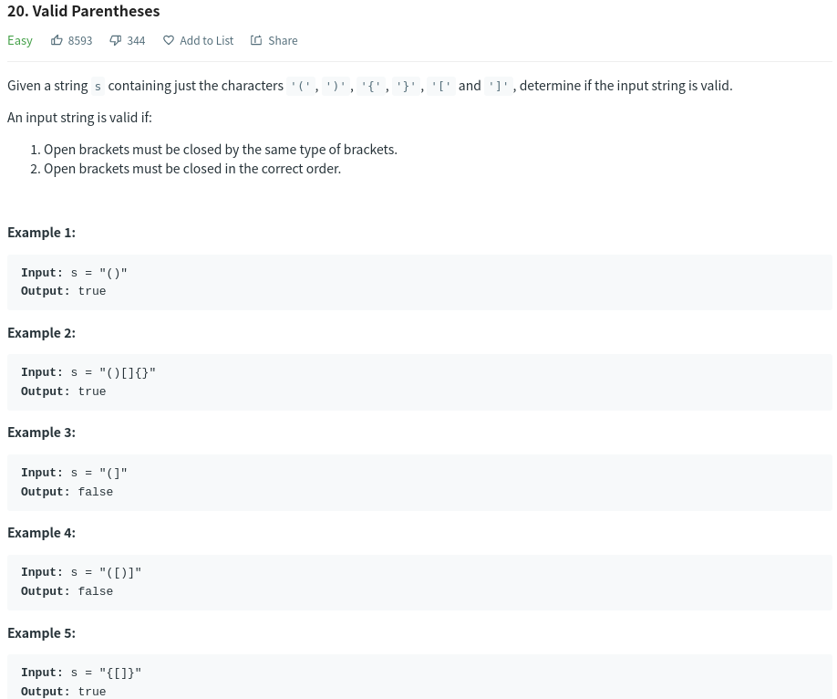

# Valid Parentheses



# Approach-Using Stack

```JS
/**
 * validptheses.js
 * @param {string} s
 * @return {boolean}
 */
var isValid = function (s) {
    const map = {
        '(': ')',
        '{': '}',
        '[': ']'
    }
    let stack = [];
    for (let i = 0; i < s.length; i++) {
        if (map[s[i]]) {
            stack.push(map[s[i]])
        }
        else if (s[i] !== stack.pop()) {
            return false;
        }
    }
    return !stack.length;
}
```
# Complexity Analysis
- **Time complexity** : O(n) because we simply traverse the given string one character at a time and push and pop operations on a stack take O(1) time.


- **Space complexity** : O(n) as we push all opening brackets onto the stack and in the worst case, we will end up pushing all the brackets onto the stack. e.g. ((((((((((.
