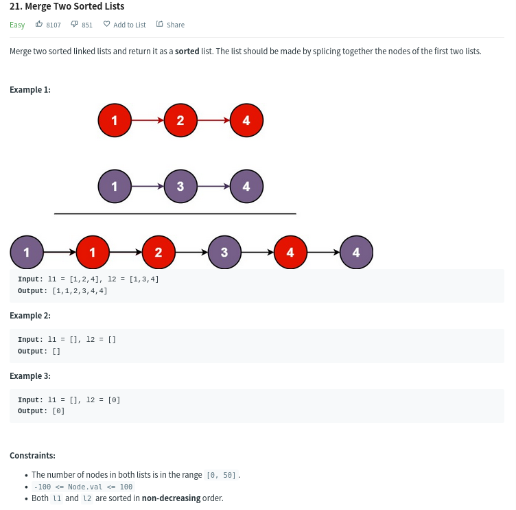
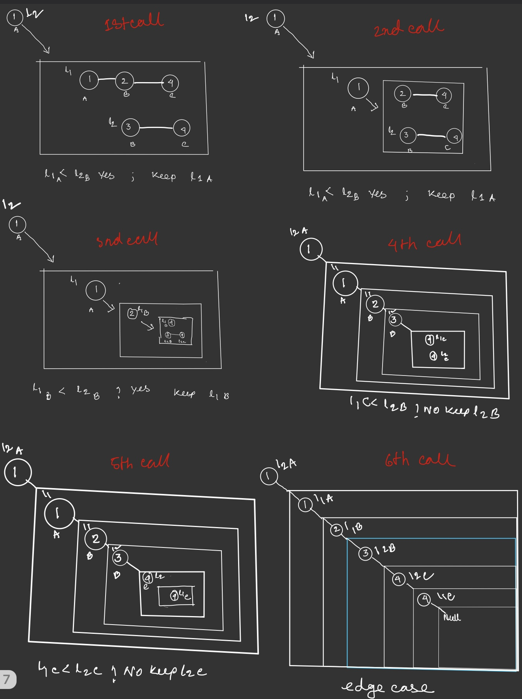

# 21.Merge Two Sorted Lists


# Approach 
 ## **Recursion:**
    
```js
/**
 * mergetwosortedlists.js
 * Definition for singly-linked list.
 * function ListNode(val, next) {
 *     this.val = (val===undefined ? 0 : val)
 *     this.next = (next===undefined ? null : next)
 * }
 */
/**
 * @param {ListNode} l1
 * @param {ListNode} l2
 * @return {ListNode}
 */
var mergeTwoLists = function(l1, l2) {
    if(l1===null) return l2;
    else if(l2===null) return l1;
    else if(l1.val < l2.val){
        l1.next = mergeTwoLists(l1.next,l2);
        return l1;
    }
    else{
        l2.next = mergeTwoLists(l1,l2.next);
        return l2;
    }
};
```

```c
/**
 * mergetwosortedlists.c
 * Definition for singly-linked list.
 * struct ListNode {
 *     int val;
 *     struct ListNode *next;
 * };
 */


struct ListNode* mergeTwoLists(struct ListNode* l1, struct ListNode* l2){
    if(l1 == NULL){
        return l2;
    }
    else if(l2 == NULL){
        return l1;
    }
    
    else if(l1->val < l2->val){
        l1->next = mergeTwoLists(l1->next,l2);
        return l1;
    }
    else{
        l2->next = mergeTwoLists(l1,l2->next);
        return l2;
    }
}
```

explaination:




<hr>

## **Loop:**
**initiating an empty node with head and keeping the address of head with temp. making links with temp pointing to smallest value from faces of two list doing snake like progression**
