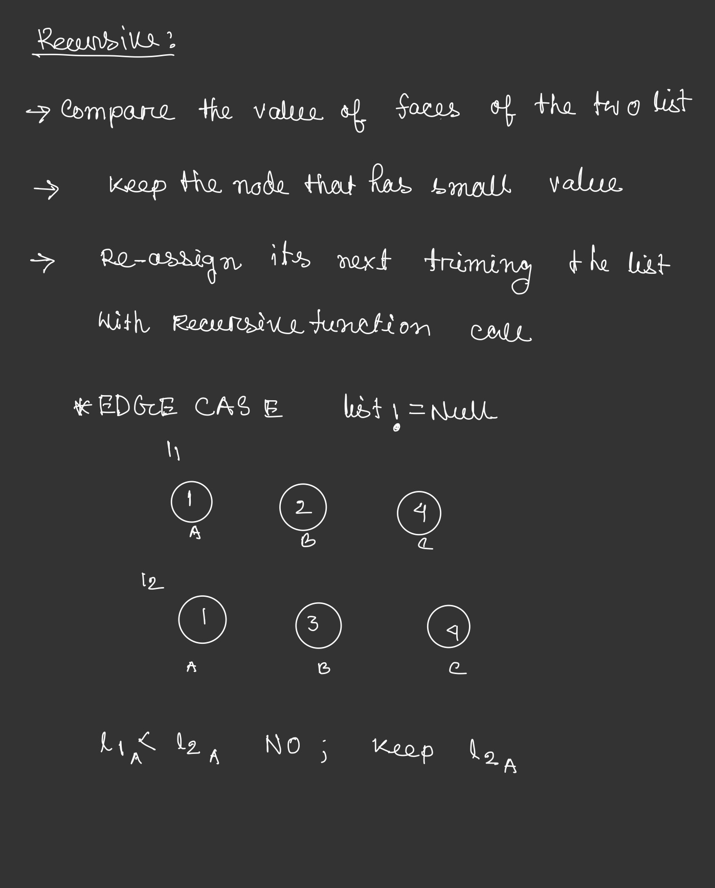
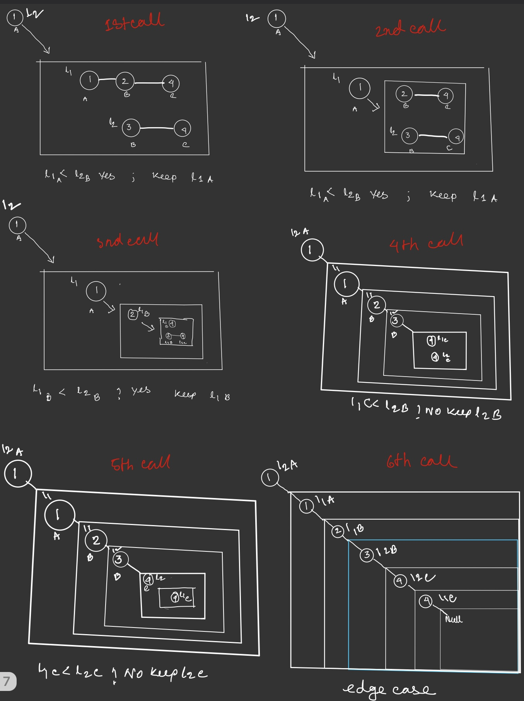

# [Merge Two Sorted Lists](https://leetcode.com/problems/merge-two-sorted-lists)

# Approach 
 ## **Recursion:**
    
```js
/**
 * mergetwosortedlists.js
 * Definition for singly-linked list.
 * function ListNode(val, next) {
 *     this.val = (val===undefined ? 0 : val)
 *     this.next = (next===undefined ? null : next)
 * }
 */
/**
 * @param {ListNode} l1
 * @param {ListNode} l2
 * @return {ListNode}
 */
var mergeTwoLists = function(l1, l2) {
    if(l1===null) return l2;
    else if(l2===null) return l1;
    else if(l1.val < l2.val){
        l1.next = mergeTwoLists(l1.next,l2);
        return l1;
    }
    else{
        l2.next = mergeTwoLists(l1,l2.next);
        return l2;
    }
};
```

```c
/**
 * mergetwosortedlists.c
 * Definition for singly-linked list.
 * struct ListNode {
 *     int val;
 *     struct ListNode *next;
 * };
 */


struct ListNode* mergeTwoLists(struct ListNode* l1, struct ListNode* l2){
    if(l1 == NULL){
        return l2;
    }
    else if(l2 == NULL){
        return l1;
    }
    
    else if(l1->val < l2->val){
        l1->next = mergeTwoLists(l1->next,l2);
        return l1;
    }
    else{
        l2->next = mergeTwoLists(l1,l2->next);
        return l2;
    }
}
```

## **Explaination:**





after the 6th call when we are in edge case the call stack  returns the values untill its empty. and we get a full chain of nodes :)

<hr>

## **Loop:**

```js
/**
 * mergetwosortedlistloop.js
 * Definition for singly-linked list.
 * function ListNode(val, next) {
 *     this.val = (val===undefined ? 0 : val)
 *     this.next = (next===undefined ? null : next)
 * }
 */
/**
 * @param {ListNode} l1
 * @param {ListNode} l2
 * @return {ListNode}
 */
var mergeTwoLists = function(l1, l2) {
    let head = {val:undefined,next:null};
    let temp  = head;
    if(l1===null) return l2;
    else if(l2===null) return l1;
    while(l1&&l2){
        if(l1.val < l2.val){
            temp.next = l1;
            l1 = l1.next;
        }
        else{
            temp.next = l2;
            l2 = l2.next;
        }
        temp = temp.next;
    }
    temp.next = l1||l2;
    return head.next;
};
```

```c
/**
 * mergetwosortedlistsloop.c
 * Definition for singly-linked list.
 * struct ListNode {
 *     int val;
 *     struct ListNode *next;
 * };
 */


struct ListNode* mergeTwoLists(struct ListNode* l1, struct ListNode* l2){
    struct ListNode head, *temp;
    temp = &head;
    if(l1==NULL) return l2;
    else if(l2==NULL)return l1;
    while(l1&&l2){
        if(l1->val < l2->val){
            temp->next = l1;
            l1 = l1->next;
        }
        else{
            temp->next = l2;
            l2 = l2->next;
        }
         temp = temp->next;
    }
    l1 ? (temp->next = l1) : (temp->next = l2);
    return head.next;
}
```

**initiating an empty node with head and keeping the address of head with temp. making links with temp pointing to smallest value from faces of two list doing snake like progression**

# Complexity Analysis
## **For Recursive Aproach:**
### Time Complexity : 0(n+m)

Because each recursive call increments the pointer to l1 or l2 by one (approaching the dangling null at the end of each list), there will be exactly one call to mergeTwoLists per element in each list. Therefore, the time complexity is linear in the combined size of the lists.

### Space Complexity: 0(n+m)

The first call to mergeTwoLists does not return until the ends of both l1 and l2 have been reached, so n+m stack frames consume O(n+m) space.

## **Iterating Aproach:**
### Time Complexity : 0(n+m)

Because exactly one of l1 and l2 is incremented on each loop iteration, the while loop runs for a number of iterations equal to the sum of the lengths of the two lists. All other work is constant, so the overall complexity is linear.

### Space Complexity: 0(1)

The iterative approach only allocates a few pointers, so it has a constant overall memory footprint.