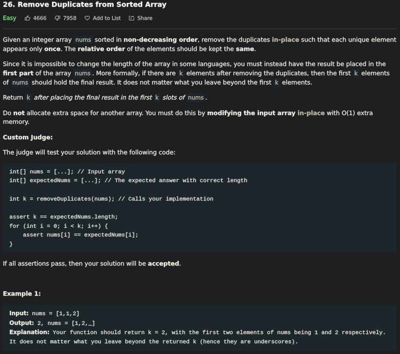

# Remove Duplicates From Sorted Array



# Approach: Two-Pointer

Becuase Input Array is already sorted we can use two pointer to track & eliminate duplicates, where pos is the slow pointer and i is the slow-runner and j is fast-runner. while nums[i]==nums[j] we increment j to skip duplicate. if nums[i]!==nums[j] we copy the unique value to nums[i+1] and increment its value. we do same process untill j reached to end of array.

we return i+1 because the problem want us to return the unique elements in the array.

```js
var removeDuplicates = function(nums) {
    let i = 0;
    for(let j=1;j<nums.length;j++){
        if(nums[i]!==nums[j]){
            nums[++i] = nums[j];
        }
    }
    return ++i;
};
```

# Time & Space Complexity

<u>**Time Complexity:**</u> O(n) .if array length is n, i and j can traverse atmost n steps. 

<u>**Space Complexity:**</u> 0(1) . because constant space is needed.