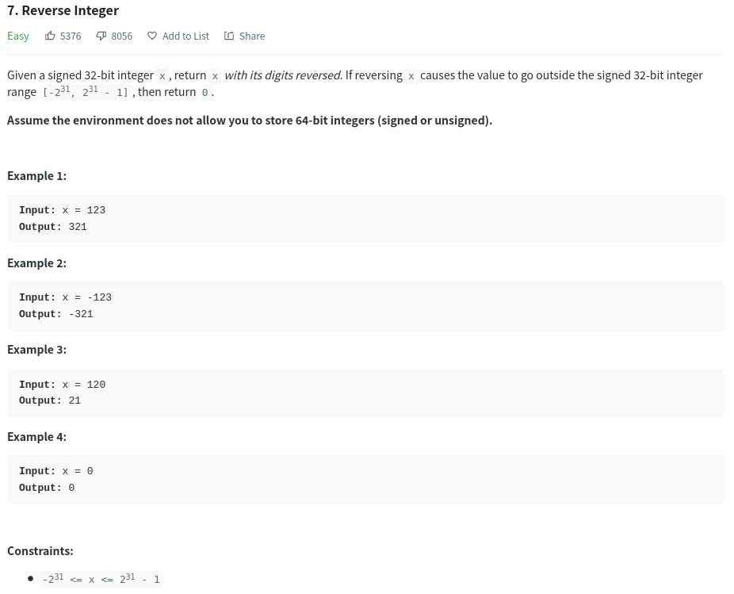

# Reverse-Integer



## Reverse String

```js
/**
 * reversestr.js
 * @param {number} x
 * @return {number}
 */
var reverse = function(x) {
  const absReversed = Math.abs(x).toString().split('').reverse().join('');
  return absReversed > 2**31 ? 0 : absReversed * Math.sign(x);
};
```
- q. how does the string multiply with Math.sign gives you a number??

- a. well because Math.sign returns a Number, and String multiply with a Number will return a Number, that's called **coercion**. 
                
        i.e '15' * -1 => -15 (Number)
